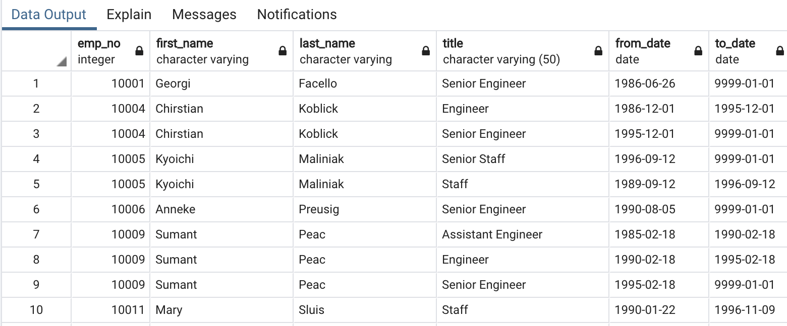
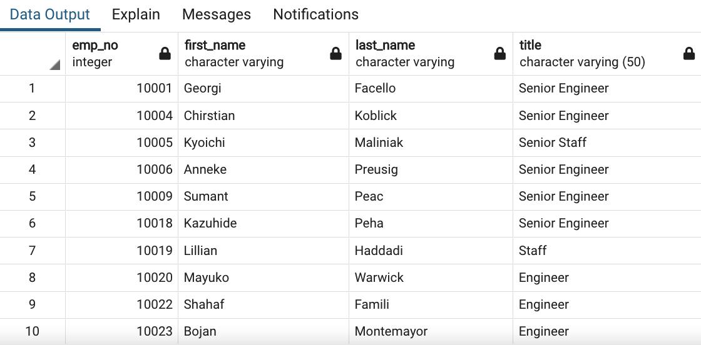
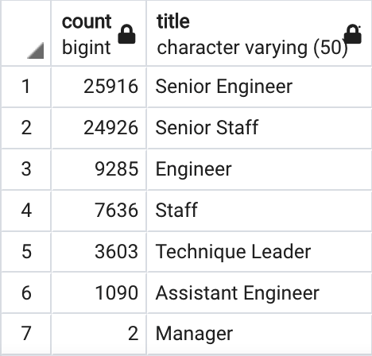
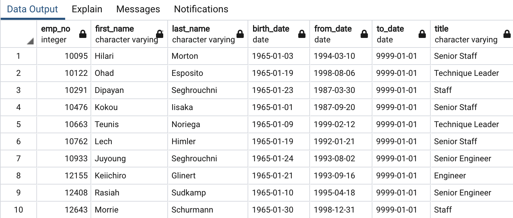
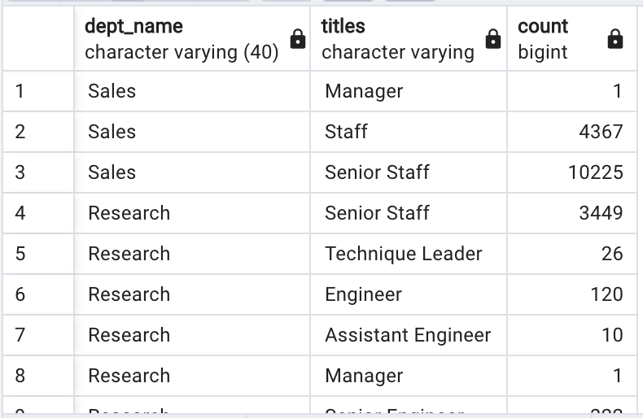
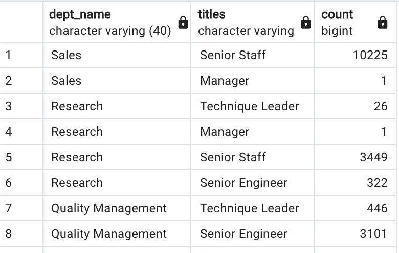

# Pewlett-Hackard-Analysis

## Project Overview

The purpose of this analysis is to conduct a database analysis for Pewlett Hackard with detailed information on the number of future retirees from all departments currently working at the company. In addition, to prepare a plan to hire new staff and create a mentorship program. The criterion was based on the birth dates ranging from 1952 to 1955

## Results
The ERD used to help visualize the relationship between the data sources and the structure of the company's employee plan to facilitate the analysis and avoid errors. 

### List of Retiriing Employees
* The table includes employee number, first name, last name, title, from-date and to-date. 
* The query returns 133,776 rows. 
* It displays a list of employees who is going to retire in the next few years. 
* Some employees appear more than once due to change of title during their career at Pewlett-Hackard. 
                
                

This query has one drawback. It contains all the titles that employees acquired while working at Pewlett-Hackard over the years. This resulted in duplicates, some employees appear two times or more (due to promotion or chnage of roles); therefore, the number of retiring employees (133,776) is huge and incorrect.To retrieve the data, two tables were merged together - employees and titles - with the inner join and filtered by birth date, that indicates who is about to retire in the next few years with the command WHERE (e.birth_date BETWEEN '1952-01-01' AND '1955-12-31').

### List of Retiring Employees without Duplicates
* The query returns 90,398 rows. 
* It includes employee number, first name, last name, title, from-date and to-date. 
* It displays a list of employees who are going to retire in the next few years. 
* In the table, each employee is listed only once, by her or his most recent title. 
               
                
                
                

The same command from previous query was used but DISTINCT ON command was added to it to remove duplicates. In addtion, I used command ORDER BY rt.emp_no, rt.to_date DESC to sort the data by descending order on the to_date column.

                
### The Number of Retiring Employees grouped by Title            
* It includes employees’ titles and their sum. 
* The query returns a cohesive table with 7 rows. 
* From this table we can quickly see how many employees with certain title will retire in the next few years. 

                

To achieve this, the GROUP BY ut.title command, and it is responsible for grouping the rows by titles. Next, I used its corresponding command COUNT (ut.title) that counts how many times specific title appears in the database.

### Mentorship Eligibility Program
Below is the list of candidates that can qualify to become members of the mentorship program. They can be considered as senior employees.

            

## Summary
The table  contains all the information about the employees that are about to retire in the next four years. To get the number of positions that will be open, I ran additional query that breaks down how many staff will retire per department. Since every department will be affected in some way this query gives more accurate numbers what each department can expect and how many roles will need to be filled.

            

From the table we can see how many qualified employees are in each department to train next generation. I created a query with additional filter, that returns only employees on higher positions, assuming that those are qualified as mentors. With the command WHERE ut.title IN ('Senior Engineer', 'Senior Staff', 'Technique Leader', 'Manager') the results include only staff on higher positions. 

            

## Resources
- Software: PgAdmin, Visual Studio Code, SQL
